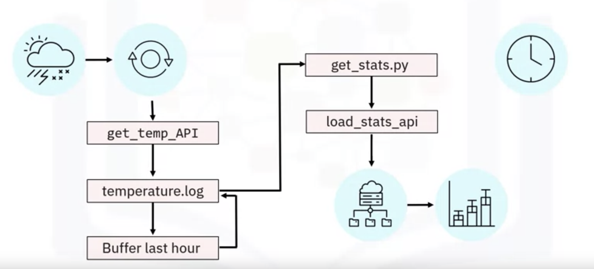

# Linux Commands and Shell Scriptin
A shell is a powerful user interface for Unix-like operating systems. It can interpret commands and run other programs. It also enables access to files, utilities, and applications, and is an interactive scripting language. Additionally, you can use a shell to automate tasks. Linux shell commands are used for navigating and working with files and directories. You can also use them for file compression and archiving. 

# Popular ETL tools
open source
- talend: talend open studio
- pandas python
- airflow
enterprise
- aws glue
- IBM InfoSphere DataStage
- Alteryx


# ETL using Shell Scripting


```sh
# cp-access-log.sh
# This script downloads the file 'web-server-access-log.txt.gz'
# from "https://cf-courses-data.s3.us.cloud-object-storage.appdomain.cloud/IBM-DB0250EN-SkillsNetwork/labs/Bash%20Scripting/ETL%20using%20shell%20scripting/".

# The script then extracts the .txt file using gunzip.

# The .txt file contains the timestamp, latitude, longitude 
# and visitor id apart from other data.

# Transforms the text delimeter from "#" to "," and saves to a csv file.
# Loads the data from the CSV file into the table 'access_log' in PostgreSQL database.

# Extract phase

echo "Extracting data"

# Extract the columns 1 (timestamp), 2 (latitude), 3 (longitude) and 
# 4 (visitorid)

# Redirect the extracted data into a file named extracted-data.txt
cut -d"#" -f1-4 web-server-access-log.txt > extracted-data.txt

# Transform phase
echo "Transforming data"

# read the extracted data and replace the colons with commas.
# The extracted columns are separated by the original “#” delimiter.
# We need to convert this into a “,” delimited file.
tr "#" "," < extracted-data.txt > transformed-data.csv


# Load phase
echo "Loading data"

# Send the instructions to connect to 'template1' and
# copy the file to the table 'access_log' through command pipeline.
# The file comes with a header. So use the ‘HEADER’ option in the ‘COPY’ command.
echo "\c template1;\COPY access_log  FROM '/home/project/transformed-data.csv' DELIMITERS ',' CSV HEADER;" | psql --username=postgres --host=localhost

# Verify by querying the database.
echo '\c template1; \\SELECT * from access_log;' | psql --username=postgres --host=localhost
```
Testing by running below in terminal:
- bash cp-access-log.sh
- cat extracted-data.txt
- cat transformed-data.csv
