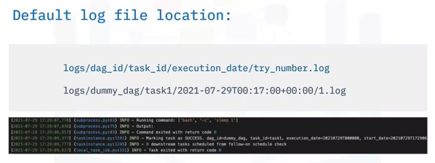

# Airflow Overview

Life cycle


Features
- pure python = flexibility
- ui = full insight
- integretion = plug and play
- easy to use = unlimited pipelien scope
- open source = community of developers

Principle
- Scalable
- Dynamic
- Extensible
- Lean

# Advantage of Using data pipelines as DAGs in Apache Airflow
- DAGs represent workflows
- Tasks implement operators, for example, python, sql or bash.
- Operators determine what each task does. Sensor operators poll for a certain time or condition. Other operators include email and HTTP request oeprations.

Python script blocks:
- Library imports
- DAG arguments
- DAG definitions
- Task definitions
- Task pipeline

```python
from airflow import DAG
from airflow.operators.bash_operator import BashOperator
import datetime as dt

default_args = {
  'owner': 'me',
  'start_date': dt.datetime(2021, 7, 28),
  'retries': 1,
  'retry_delay': dt.timedelta(minutes=5),
}

dag = DAG('simple_example',
           description='A simple example DAG',
           default_args=default_args,
           schedule_interval=dt.timedelta(seconds=5))

task1 = BashOperator(
    task_id='print hello',
    bash_command='echo \'Greatting\'',
    dag=dag,
)

task2 = BashOperator(
    task_id='print date',
    bash_command='date',
    dag=dag,
)

task1 >> task2
```

Airflow Schedule
- Deploys on Worker Array
- Follows your DAG
- First DAG Run

Define as Code
- Maintainable
- Versionable
- Collaborative

# Airflow Logs


Airflow log files


Reviewing task events via UI


Monitoring metrics
- Counters: metrics that always increase
  - Total count of task instances failures
  - Total count of task instance successes
- Gauges: metrics that may fluctuate
  - Number of running tasks
  - DAG bag size, or number of DAGs in production
- Timers: metrics related to time duration
  - Milliseconds to finish a task
  - Milliseconds to reach a success or failed state 

Storing and analyzing metrics

